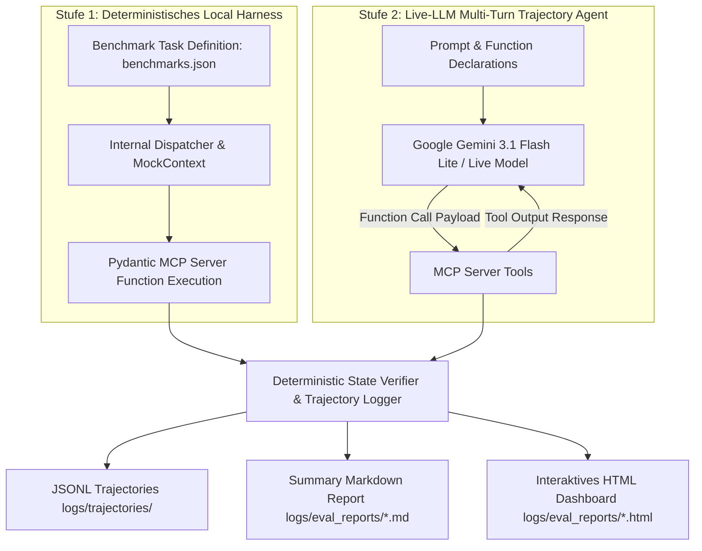

 
# DokuWiki-MCP

An [MCP](https://modelcontextprotocol.io/) server that exposes DokuWiki's JSON-RPC API as structured tools and resources for LLM agents. Built with [FastMCP](https://github.com/jlowin/fastmcp) over SSE transport.

## Scope

- Wraps the full DokuWiki JSON-RPC surface: pages, media, ACLs, locks, search, recent changes
- Auto-generated typed client (`client.py`) from `codegen/dokuwiki.json` via Jinja2
- Auth priority: Bearer JWT → Basic Auth → `.env` fallback credentials
- 6 MCP **resources** (no params: `wiki_whoAmI`, `wiki_getWikiTitle`, …) + 20+ **tools** (parameterized: `wiki_savePage`, `wiki_searchPages`, …)

## Stack

| Layer | Technology |
|---|---|
| MCP framework | FastMCP + Uvicorn (SSE) |
| HTTP client | httpx |
| Config | pydantic-settings + `.env` |
| Wiki backend | DokuWiki (LinuxServer image) |
| Debug UI | MCP Inspector (Node.js, port 6274) |

## Quickstart

```bash
# start all services (wiki + mcp server + inspector)
docker compose up -d --build
```

| Service | URL |
|---|---|
| DokuWiki | http://localhost:8080 |
| MCP Server (SSE) | http://localhost:8000 |
| MCP Inspector | http://localhost:6274 |

## Configuration

All settings via `.env` (or environment variables in `docker-compose.yml`):

```bash
DOKUWIKI_URL=http://localhost:8080   # target wiki base URL
DOKUWIKI_URL_REWRITE=0               # 0=doku.php?id=  1=/page  2=doku.php/page

DOKUWIKI_TOKEN=<JWT>                 # preferred: short-lived JWT from DokuWiki admin
DOKUWIKI_USER=mcp-read               # fallback basic auth (ignored if token is set)
DOKUWIKI_PASSWORD=mcp

MCP_TRANSPORT=sse                    # transport protocol (sse | stdio)
HOST=0.0.0.0                         # bind address
MCP_ALLOW_ALL_HOSTS=true             # allow cross-origin requests
```

## Code Generation

The typed JSON-RPC client is generated from the DokuWiki API schema:

```bash
python codegen/generate_client.py    # regenerates src/dokuwiki_mcp/client.py
```

## Dev Accounts (docker test setup)

```bash
# admin
username: root  /  password: root

# read-only api user
username: mcp-read  /  password: mcp
groups: api, read

# write api user
username: mcp-write  /  password: mcp
groups: api, write
```

See [docker/DOKUWIKI.md](docker/DOKUWIKI.md) for full tokens and curl examples.

## Maturity Matrix & Implementation Coverage

Die folgende Tabelle gibt den aktuellen Reifegrad und die Abdeckung der Architektur-Konzepte (gemäß `architecture_adr_prd/02_matrix_category_concept.md` und `03_future_maturity_plan.md`) im Codebase wieder:

| Kategorie | Konzept | Status | Tool & Methode (`src/dokuwiki_mcp/server.py`) | Abgedeckte Teilaspekte | Offene / Fehlende Aspekte |
|---|---|---|---|---|---|
| **Architecture Base** | **DTO Pattern** | ✅ Implementiert | Super-Tools (`wiki_*`) vs. Pydantic RPC Client (`client.py`) | Entkopplung von internen RPC-Typen zu verdichteten, LLM-optimierten Interfaces | - |
| | **Polymorphic Tooling** | ✅ Implementiert | 5 Super-Tools mit `action` Enums | Konsolidierung der API-Fläche zur Tool-Bloat-Vermeidung | - |
| | **Graceful Degradation** | ✅ Implementiert | `wiki_raw_proxy` & `dokuwiki://raw_api_spec` Resource | Sicheres Fallback auf raw JSON-RPC mit auto-generierter Dokumentations-Spec | - |
| | **Error as Actionable Prompts** | ✅ Implementiert | `_unwrap`, `ActionableDokuWikiError`, `_log_error_trace_stack` | Konkrete Handlungsempfehlungen (Hints) bei HTTP/RPC-Fehlern statt Stacktraces | - |
| **Read & Search (Input-Kompression)** | **Layout Stripping** | ✅ Implementiert | `wiki_read_content` (`format="markdown"`, `_dokuwiki_to_markdown`) | DokuWiki-Markup Transformation in sauberes Markdown | - |
| | **Lokale Keyword-Extraktion** | ✅ Implementiert | `wiki_read_content` (`action="extract_insights"`, YAKE) | Lokale NLP-Extraktion der Top-Keywords ohne LLM-Tokenverbrauch | - |
| | **Progressive Disclosure** | ✅ Implementiert | `wiki_read_content` (`action="get_structure"`, `section_id`) | Abruf des TOC-Trees & bedarfsgerechtes Nachladen von Kapiteln | - |
| | **Meta-Data Aggregation** | ✅ Implementiert | Tool Output Headers & `wiki_admin_and_meta` | Kompakte Zusammenfassung von ACLs, Autoren und Revisionsdaten | - |
| | **Pagination Abstraction** | ✅ Implementiert | `wiki_search_and_explore` | Transparente serverseitige Aggregation großer Listen/Treffer | - |
| | **Extrahierende Zusammenfassung** | ⏳ Geplant (P2) | `wiki_read_content` | Konzept definiert (TF-IDF / TextRank) | Fehlt im Code (Lokaler Sentence Summarizer Engine) |
| | **Backlink Contextualization** | ⏳ Geplant (P2) | `wiki_read_content` (`action="get_links"`) | Link-Discovery | Fehlt im Code (Satz-Kontext aus verweisenden Seiten) |
| | **Content Chunking / Flat-File Read** | 🛑 Postponed | Dateisystem / PHP Plugin | - | Direkter `.txt` Datei-Zugriff / AST Tree Parsing auf später verschoben |
| **Read & Search (Output-Optimierung)** | **Multi-Query Batching & Compound Action Chaining** | ✅ Implementiert | `wiki_batch_execute` & `wiki_search_and_explore` | Heterogene Parallel-Ausführung von Macro-Tool-Arrays in einem einzigen Roundtrip | - |
| | **Negative Prompting** | ✅ Implementiert | `wiki_search_and_explore` (`exclusions: List[str]`) | Serverseitiges Filtern und Ausschließen irrelevanter Namespaces | - |
| | **Fuzzy Resolution** | ✅ Implementiert | `_resolve_page_id`, `_resolve_media_id`, `_resolve_namespace` | Levenshtein-Distanz Korrektur bei Tippfehlern in Page/Media IDs & Namespaces | - |
| | **Regex-gestützte Extraktion** | ✅ Implementiert | `wiki_search_and_explore` (`pattern`), `wiki_read_content` (`regex_filter`) | Zeilen- & ID-Filtering nach Regex-Muster | - |
| | **Zeitliche Filter** | ✅ Implementiert | `wiki_search_and_explore` (`modified_after`) | Datums- & Timestamp-basierte Einschränkung der Treffermenge | - |
| | **Stateful Namespace Traversal** | ✅ Implementiert | `wiki_admin_and_meta` (`action="set_namespace"`), `_SESSION_NAMESPACES` | In-Memory Session-Speicherung des aktiven Namespace Contexts | - |
| **Agentic Authoring (Schreiben)** | **Two-Phase Commit (Plan/Exec)** | ✅ Implementiert | `wiki_write_and_modify` (`prepare_write`, `dry_run`, `commit`, `rollback`) | Entwurfs-Speicherung (UUID), Diff-Vorschau und explizites Commit | - |
| | **Section-Level Edits** | ✅ Implementiert | `wiki_write_and_modify` (`action="modify_section"`, `section_id`) | Gezieltes Editieren einzelner Kapitel-Blöcke | - |
| | **Syntax Linting Hook** | ✅ Implementiert | `_lint_dokuwiki_syntax()` | Validierung der DokuWiki-Syntax vor Schreib- & Patch-Aktionen | - |
| | **Conflict Resolution** | ⏳ Geplant (P1) | `wiki_write_and_modify` | Concurrent Edit Erkennung (Timestamp Match) | Fehlt im Code (Zwei-Wege Merge mit Diff-Conflict-Markern) |
| | **Tone & Voice Alignment** | ⏳ Geplant (P1) | `wiki_read_content` | Standard Output Formatting | Fehlt im Code (Namespace-spezifische Stilrichtlinien im Response-Header) |
| | **Automated Taxonomy** | ⏳ Geplant (P1) | `wiki_write_and_modify` | YAKE Keyword Matcher vorbereitet | Fehlt im Code (Auto-Injektion des `{{tag>...}}` Blocks beim Speichern) |
| **Tracing & Infrastructure** | **Session Metrics & Traceability** | ✅ Implementiert | `_log_tool_invocation`, `_log_tool_error`, `_log_error_trace_stack` | Request-ID Tracing, strukturierte JSON Audit Logs & Error Metrics | - |
| | **6-Tier Domain Caching & Invalidation** | ✅ Implementiert | `cachetools.TTLCache` in `server.py` | Granulare 6-Tier Caches (Page/Media List, Info, Content + System Meta) & Hit Metrics Summary Logger | - |

---

## 🧪 Benchmark, Telemetrie & Live-LLM Evaluation Suite

Das DokuWiki-MCP-Repository verfügt über ein integriertes, 3-schichtiges Telemetrie- und Evaluations-Framework (`scripts/run_mcp_eval.py` & `tests/benchmarks/verifier.py`), das sowohl isolierte Performance-Messungen als auch autonome Live-Agenten-Interaktionen quantitativ bewertet.

### Architektur der Evaluations-Stufen



### Gemessene KPIs & Telemetrie-Dimensionen

* **Layer B (Agent Level):**
  * **`Pass@1` Success Rate:** Anteil der Aufgaben, deren Zustand nach Ausführung deterministisch korrekt auf der Festplatte/DokuWiki validiert wurde (Dateiexistenz, Inhalt, Tagging, Soft-Deletes).
  * **`N_turns` (Trajectory Length):** Anzahl der Interaktions-Schleifen/Tool-Calls bis zum Erreichen der Lösung.
  * **`T_dto` (Response Tokens):** Token-Verbrauch der modellgenerierten Funktionsaufrufe.
* **Layer A (Pure MCP Overhead):**
  * **`L_mcp` (Server Processing Time):** Durch das MCP-Server-Framework isolierte Rechenzeit in Millisekunden (Parsing, Telemetrie, Schema-Validierung, Caching).
  * **`C_tokens` (Token Compression Factor):** Verhätnis von Rohdaten zu verdichtetem Markdown Output (LLM-Kontextfenster-Einsparung).
  * **`E_schema` (Schema Validation Errors):** Anzahl vom LLM gesendeter ungültiger Parameter, die serverseitig abgefangen/korrigiert wurden.
* **Layer C (Subsystem Latency):**
  * **`L_wiki` (Backend Execution Time):** Dauer der PHP XML-RPC API Netzwerk- und Verarbeitungszeit im DokuWiki-Container.

---

## 🛠️ How To: Benchmark & Test Tools verwenden

### Prerequisites & Setup

Stelle sicher, dass der DokuWiki-Docker-Container läuft und das Python Virtual Environment vorbereitet ist:

```bash
# 1. Docker Services starten
docker compose up -d --build

# 2. Virtual Environment aktivieren
source .venv/bin/activate
```

Stelle sicher, dass deine `.env` Datei den `GEMINI_API_KEY` und Telemetrie-Variablen enthält:

```env
MCP_ENABLE_TELEMETRY=true
MCP_LOG_LEVEL=INFO
GEMINI_API_KEY=dein_google_gemini_api_key
```

### 1. Stufe 1: Deterministischen Benchmark Harness ausführen (Schnell-Validierung)

Misst isoliert die serverseitige Logik, Caching-Effizienz und Ausführungszeiten aller 30 Benchmark-Tasks ohne externe API-Aufrufe:

```bash
./.venv/bin/python scripts/run_mcp_eval.py
```

### 2. Stufe 2: Live LLM Agent Evaluation ausführen (Gemini Live Mode)

Führt alle 30 Tasks autonom gegen die Google Gemini API aus, zeichnet Multi-Turn Trajektorien auf und prüft das echte Funktionsaufrufs-Verhalten:

```bash
# Ausführung aller 30 Tasks mit unbegrenztem Kontingent (Gemini 3.1 Flash Lite)
./.venv/bin/python scripts/run_mcp_eval.py --live --model gemini-3.1-flash-lite

# Schnelle Stichprobe (z. B. nur die ersten 5 Tasks)
./.venv/bin/python scripts/run_mcp_eval.py --live --model gemini-3.1-flash-lite --limit 5
```

### 3. Auswertung der Ergebnisse & Dashboard ansehen

Nach jedem Durchlauf werden im Verzeichnis `logs/eval_reports/` zwei Auswertungs-Dateien erzeugt:

1. **Markdown Zusammenfassungsbericht (`eval_report_YYYYMMDD_HHMMSS.md`):**  
   Tabellarische Übersicht aller KPIs (`Pass@1`, `L_mcp`, `L_wiki`, `C_tokens`, `E_schema`) und Status pro Task ID.
2. **Interaktives HTML Dashboard (`dashboard_YYYYMMDD_HHMMSS.html`):**  
   Visualisiertes Dashboard im Dark-Design mit:
   * Dynamischen 3-Sektoren-Tooltips (Was ist das?, Ziel/Bewertung, ⚙️ Wie im MCP beeinflussen?) für alle Karten, Tabellenköpfe und Tabellenzeilen.
   * Interaktiver JavaScript-Spaltensortierung (Klick auf `Task ID`, `Category`, `Status`, `Turns`, `MCP Latency`, `Wiki Latency`, `Tokens`, `Compression`).

```bash
# Letztes generiertes HTML Dashboard im Browser öffnen (Linux/Ubuntu)
xdg-open logs/eval_reports/dashboard_*.html
```

