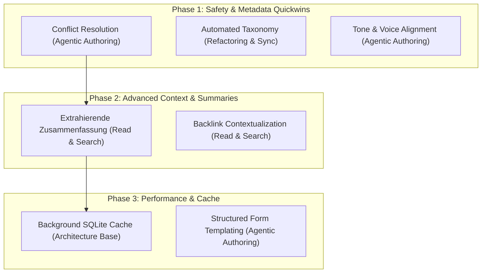

# Roadmap: Future DokuWiki MCP Maturity Plan (Mapped to Concept Matrix)

This plan maps remaining features from the **Concept Matrix** ([02_matrix_category_concept.md](file:///home/david/git/dokuwiki-mcp/architecture_adr_prd/02_matrix_category_concept.md)) directly to execution phases.

---

## 1. Mapped Roadmap & Phases

The diagram below shows the progression of our future features, mapped directly to their matrix categories:

---

## 2. Complete Matrix Coverage & Status Tracker

Here is the status mapping of the entire concept matrix:

### 1. Read & Search (Input-Kompression)
*   **Layout Stripping:** **[DONE]** (Implemented via `_dokuwiki_to_markdown` translator).
*   **Lokale Keyword-Extraktion:** **[DONE]** (Integrated with YAKE).
*   **Progressive Disclosure:** **[DONE]** (Implemented via `get_structure` action).
*   **Meta-Data Aggregation:** **[DONE]** (YAML metadata headers).
*   **Pagination Abstraction:** **[DONE]** (Autopagination in search/lists).
*   **Extrahierende Zusammenfassung:** **[PHASE 2]** (TextRank summary tool).
*   **Backlink Contextualization:** **[PHASE 2]** (Context sentences around backlinks).
*   **Content Chunking:** **[POSTPONED]** (Using section-level edits for now).
*   **Lokale Vektorsuche:** **[POSTPONED]** (Avoids model download size overhead).
*   **Strukturelles Hashing:** **[POSTPONED]** (High complexity, low token utility).

### 2. Read & Search (Output-Optimierung)
*   **Multi-Query Batching:** **[DONE]** (Accepts lists of queries).
*   **Negative Prompting:** **[DONE]** (Integrated exclusions).
*   **Fuzzy Resolution:** **[DONE]** (Fuzzy Levenshtein spelling correction).
*   **Regex-gestützte Extraktion:** **[DONE]** (Server-side `regex_filter` matches).
*   **Stateful Namespace Traversal:** **[DONE]** (Session active namespace).
*   **Zeitliche & Strukturelle Filter:** **[DONE]** (`modified_after` filtering).

### 3. Agentic Authoring (Schreiben)
*   **Two-Phase Commit:** **[DONE]** (`prepare_write` + cached UUID + `commit`/`rollback`).
*   **Section-Level Edits:** **[DONE]** (Implemented via section indices).
*   **Conflict Resolution:** **[PHASE 1]** (Zwei-Wege-Merge conflict markers).
*   **Tone & Voice Alignment:** **[PHASE 1]** (Namespace-specific style guides).
*   **Dynamic Templating:** **[PHASE 3]** (Pydantic forms rendering).
*   **Idempotent Writes:** **[POSTPONED]** (Using UUID transactions for safety).

### 4. Refactoring & Sync (Umstrukturieren)
*   **Syntax Linting Hook:** **[DONE]** (Syntax validation before writing).
*   **Automated Taxonomy:** **[PHASE 1]** (Suggesting page tags).
*   **Orphan Resolution:** **[POSTPONED]** (Can be executed via scripts).
*   **Cross-Reference Checking:** **[POSTPONED]** (High risk of rewriting files).

### 5. Agentic Bridging (System-Übersetzung)
*   **AST Mapping, Macro Emulation, Asset Relocation:** **[POSTPONED]** (Out-of-scope for core MCP; better suited for a migration sub-server).

---

## 3. Phase-by-Phase Technical Specifications

### Phase 1: Safety & Metadata Quickwins

#### 1. Conflict Resolution (Concept: `Conflict Resolution`)
* **Matrix Category:** Agentic Authoring (Schreiben).
* **Goal:** Detect edit collisions if the wiki page changed while the LLM was formulating the edit.
* **Implementation:**
  * When `wiki_write_and_modify` is called for `save_page` or `patch_page`, the server fetches the page's current last-modified timestamp (`lastModified`) and compares it with the timestamp from the session when the LLM first read the page.
  * If the page was modified in the meantime, the write is aborted, and a two-way diff with conflict markers (`<<<<<<< CURRENT_LIVE` / `=======` / `>>>>>>> PROPOSED_EDIT`) is returned.

#### 2. Automated Taxonomy (Concept: `Automated Taxonomy`)
* **Matrix Category:** Refactoring & Sync (Umstrukturieren).
* **Goal:** Suggest page tags automatically on save.
* **Implementation:**
  * The server extracts keywords using the local YAKE extractor. It matches these keywords against existing tags throughout the namespace.
  * During page saves, if tag matches are found, it appends a standard tagging block to the footer of the page (e.g. `{{tag>keycloak sso config}}`).

#### 3. Tone & Voice Alignment (Concept: `Tone & Voice Alignment`)
* **Matrix Category:** Agentic Authoring (Schreiben).
* **Goal:** Guide the LLM to write in the correct style per namespace.
* **Implementation:**
  * Define style guides mapping (e.g. `/playground` -> "Draft tone", `/docs` -> "Strict technical documentation").
  * Append style hints to `wiki_read_content` return payloads.

---

### Phase 2: Advanced Context & Summaries

#### 4. Extrahierende Zusammenfassung (Concept: `Extrahierende Zusammenfassung`)
* **Matrix Category:** Read & Search (Input-Kompression).
* **Goal:** Compress long pages into a concise overview.
* **Implementation:** Implement a lightweight Python sentence TF-IDF summarizer.

#### 5. Backlink Contextualization (Concept: `Backlink Contextualization`)
* **Matrix Category:** Read & Search (Input-Kompression).
* **Goal:** Retrieve sentences surrounding backlinks on referring pages.
* **Implementation:** Scan referring pages for the link and return the adjacent sentence contexts.
