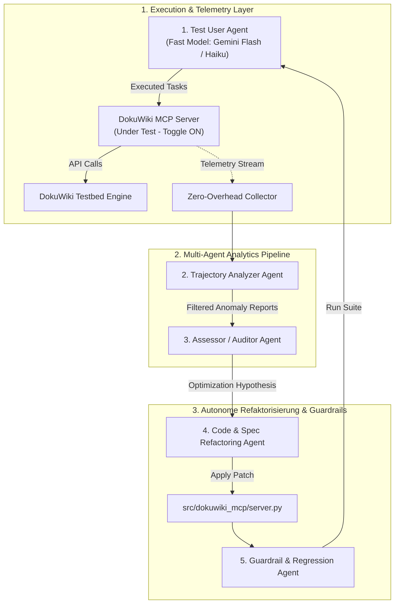

# Architektur- & Konzeptpapier: Agentische MCP-Optimierung & Autonomes Evaluation-Framework

**Dokument-ID:** `architecture_adr_prd/04_agentic_optimizations.md`  
**Status:** In Review / Planned  
**Datum:** 15. Juli 2026  
**Zielsystem:** DokuWiki MCP Server (`dokuwiki-mcp`)

---

## Teil A: Konzeptpapier – Benchmarking, Zero-Overhead Telemetrie & Multi-Agenten-Framework

### 1. Ausgangslage & Motivation

Der DokuWiki MCP-Server dient als semantische Middleware zwischen Large Language Models (LLMs) und einer DokuWiki-Instanz. Durch die Einführung des **DTO-Patterns** und von **Polymorphic Super-Tools** wurde der Tool-Bloat drastisch reduziert.

Um jedoch maximale **Effizienz und Performanz** im alltäglichen Betrieb zu erreichen, reicht eine statische Tool-Entwicklung nicht aus. Die Qualität der Agenten-Interaktion hängt direkt davon ab:
1. wie präzise die JSON-Schemas und `Field`-Beschreibungen vom Modell verstanden werden (Zero-Shot Tool Selection),
2. wie viele Roundtrips ein Modell benötigt, um eine komplexe Aufgabe zu lösen,
3. wie stark der Kontext durch redundante API-Antworten belastet wird (Token-Verbrauch).

---

### 2. Zusätzliche System-Anforderungen

#### 2.1 Zero-Overhead im Produktivbetrieb (Vollständige Entkoppelung)
* Die Instrumentierung zur Auswertung (Tracing, Telemetrie, Logging) **darf die Produktiv-Performance nicht beeinträchtigen**.
* **Feature Toggle / No-Op Pattern:** Sämtliche Tracing-Decorators und Evaluierungs-Hooks sind über eine Umgebungsvariable (`MCP_ENABLE_TELEMETRY=false`) vollständig deaktivierbar.
* Bei deaktivierter Telemetrie führen die Tracing-Wrapper No-Op-Methoden aus oder werden beim Serverstart gar nicht erst in die Middleware-Kette injiziert (0% CPU-/Memory-Overhead im Live-Betrieb).

#### 2.2 Full-Power Multi-Agenten-Orchestrierung
* Das Evaluierungs- und Optimierungs-Framework nutzt ein autonomes Multi-Agenten-System mit klar definierten Rollen, Hand-Offs und systematischen Feedbackschleifen.
* Die Agenten agieren kollaborativ: Vom Stresstesting über Log-Analyse, Prompt-/Code-Mutation bis hin zur automatisierten Regressionsprüfung.

#### 2.3 Rauschfreies KPI-System mit Schichten-Isolierung
* Metriken müssen den **MCP-Server rein isoliert bewerten** und dürfen nicht durch Schwankungen externer Subsysteme (z. B. träge DokuWiki-HTTP-Antworten oder LLM-Netzwerklatenzen) verfälscht werden.
* Das KPI-System rechnet Backend- und Netzwerk-Effekte transparent heraus.

---

### 3. Das Rauschfreie KPI-System (Schichten-Metriken)

Um aussagekräftige und widerspruchsfreie Ergebnisse zu garantieren, werden die Messwerte strikt in drei Ebenen unterteilt:

```
+-----------------------------------------------------------------------+
| LAYER A: PURE MCP CORE ENGINE METRICS (Isoliert vom Backend & LLM)   |
| - L_mcp (MCP Processing Overheads in ms)                             |
| - C_tokens (Kompressionseffizienz: Raw Tokens vs. DTO Tokens)         |
| - E_mcp_schema (Schema & Enum Invalid Parameter Rate)                 |
+-----------------------------------------------------------------------+
                                  |
+-----------------------------------------------------------------------+
| LAYER B: AGENTIC TRAJECTORY METRICS (LLM-Interaktions-Qualität)       |
| - Pass@1 (Deterministische Task Success Rate: 0 oder 1)               |
| - N_turns (Trajektorien-Länge / Roundtrip Count)                      |
| - T_total (Gesamtsumme konsumierter Prompt- & Completion-Tokens)     |
+-----------------------------------------------------------------------+
                                  |
+-----------------------------------------------------------------------+
| LAYER C: EXTERNAL SUBSYSTEM TELEMETRY (Abgegrenzte Störfaktoren)      |
| - L_wiki (DokuWiki HTTP / XML-RPC Backend Latency)                   |
| - L_llm (Externe Generation / Inference Time des LLM-Providers)      |
+-----------------------------------------------------------------------+
```

#### 📊 KPI-Katalog im Detail:

| Ebene | KPI / Metrik | Formel / Messung | Zielwert | Erläuterung & Isolierung |
| :--- | :--- | :--- | :--- | :--- |
| **Layer A** | **Pure MCP Overhead (`L_mcp`)** | $L_{\text{total}} - (L_{\text{wiki}} + L_{\text{llm}})$ | $< 5\,\text{ms}$ | Isolierte Python-Rechenzeit in `server.py` (Parsing, Filtering, Templating). Rechnet DokuWiki- & LLM-Zeiten raus. |
| **Layer A** | **Token Compression Ratio (`C_tokens`)** | $\frac{\text{Tokens}(\text{Raw DokuWiki RPC Payload})}{\text{Tokens}(\text{Compressed MCP Response})}$ | $> 4.0\times$ | Misst den direkten Erfolg der semantischen Kompression (Layout Stripping, YAKE, DTOs). |
| **Layer A** | **MCP Schema Error Rate (`E_mcp_schema`)** | $\frac{\text{Schema/Validation Error Calls}}{\text{Total Calls}}$ | $0.0\%$ | Misst, wie klar und verständlich die `@mcp.tool`-Field-Beschreibungen für das LLM formuliert sind. |
| **Layer B** | **Task Success Rate (`Pass@1`)** | Binärer Check der Wiki-Zustände nach Aufgabenausführung | $\ge 95\%$ | Task-Lösungserfolg durch deterministische File-/Regex-Assertions im Testbed. |
| **Layer B** | **Trajectory Length (`N_turns`)** | Anzahl Modell-Turns bis `Pass@1` | Minimieren | Zeigt den Erfolg von Polymorphic Super-Tools und Batch-Execution. |
| **Layer B** | **Total Tokens (`T_total`)** | $\sum \text{Prompt Tokens} + \text{Completion Tokens}$ | Minimieren | Gesamte Kontext-Belegung über die Lösungstrajektorie. |
| **Layer C** | **Backend Latency (`L_wiki`)** | $T_{\text{HTTP\_Response}} - T_{\text{HTTP\_Request}}$ | Telemetrie | Reines DokuWiki-Verhalten (Docker container/PHP execution latency). |
| **Layer C** | **Inference Time (`L_llm`)** | $T_{\text{LLM\_Response}} - T_{\text{LLM\_Prompt}}$ | Telemetrie | Reines LLM-Provider-Verhalten. |

---

### 4. Benchmark Corpus Methodology & Ground Truth Realism (Synthetik vs. Repräsentativität)

Für die kontinuierliche Bewertung der MCP-Performance ist die Beschaffenheit des unterliegenden DokuWiki-Bestands (Seed Corpus) von entscheidender Bedeutung. Das Evaluierungs-Framework unterscheidet strikt zwei Prüf-Dimensionen:

#### 4.1 Die zwei Prüf-Dimensionen des Benchmarks

1. **Dimension A: Routing-, Schema- & Intent-Validation (Corpus-Unabhängig)**
   * **Ziel:** Prüft, ob das LLM anhand der Prompt-Formulierung und der `Field(description=...)`-Annotationen deterministisch die richtigen Tools, Actions und Parameter-Constraints auswählt (z. B. `action='list'`, `exclusions=['drafts']` oder `get_structure`).
   * **Charakteristik:** Diese Verhaltens-Logik ist **vollkommen unabhängig von der Wiki-Füllmenge**. Ein kleines, synthetisches Wiki reicht aus, um $Pass@1$, $N_{\text{turns}}$ und $E_{\text{schema}}$ valide zu messen.

2. **Dimension B: Volumeneffizienz & Semantic Compression (Corpus-Abhängig)**
   * **Ziel:** Misst die tatsächliche Token-Einsparung ($C_{\text{tokens}}$), TF-IDF Keyphrase-Extraktion (`extract_insights`) und die Python-Rechenzeit ($L_{\text{mcp}}$) unter realistischen Datenmengen.
   * **Charakteristik:** In einem leeren oder minimalistischen Wiki fallen $C_{\text{tokens}}$ und $L_{\text{mcp}}$ künstlich niedrig aus, da keine großen HTML/Markdown-Payloads gefiltert werden müssen. Erst mit einem umfangreichen Datenkorpus zeigt die semantische Kompression ihre volle Wirkung.

---

#### 4.2 Guidelines & Konkrete Handlungsempfehlungen

> [!IMPORTANT]
> **Guideline 1: Reales Enterprise-IT Seed Corpus in den Fixtures pflegen**  
> Die Fixtures unter `docker/dokuwiki-data/pages/` müssen ein repräsentatives IT-Enterprise-Corpus (mind. 50–100 reale Dokumentations-Seiten) enthalten. Dazu gehören:
> - Verschachtelte Namespaces (`architecture:`, `operations:`, `drafts:`, `archive:`).
> - Umfangreiche Einzelseiten (mind. 50–100 KB Text, tiefe H1-H4 Hierarchien, Tabellen, Codeblöcke).
> - Gezielte Fachdomänen (z. B. Keycloak IAM, Kubernetes Ingress, CI/CD Pipelines, Incident Logs).

> [!TIP]
> **Guideline 2: Entkopplung von Verifier-Assertions und dynamischen Inhalten**  
> State-Verifier in `verifier.py` dürfen nicht auf volatile Fließtexte prüfen, sondern nutzen deterministische Invarianten:
> - Trajektorien-Parameter-Checks (z. B. `excluded_namespaces=["drafts"]`).
> - Spezifische Tags oder Header-Prüfungen.
> - Exakte Dateisystem-Assertions für erzeugte/modifizierte Seiten.

> [!NOTE]
> **Guideline 3: Regelmäßige Rekalibrierung des Golden Datasets**  
> Bei jeder Erweiterung des MCP-Funktionsumfangs muss das `benchmarks.json` um mindestens zwei Grenzfälle erweitert werden:
> 1. Einen Positiv-Test auf großen Datenmengen (Große Payloads zur Verifikation von $C_{\text{tokens}} > 4.0\times$).
> 2. Einen Negativ-/Exclusion-Test auf geschützten oder veralteten Namespaces.

---

### 5. Geschlossene Multi-Agenten-Optimierungsarchitektur (Closed-Loop Framework)

Das Framework nutzt ein orchestriertes Multi-Agenten-System mit 5 spezialisierten Rollen:



#### Die Multi-Agenten Rollen im Detail:

1. **Test User Agent (Stresstester):**
   * Arbeitet synthetische Benchmarks ab. Verwendet schnelle, günstige Modelle (Gemini 2.5 Flash / Claude Haiku), um unklare Tool-Schemas gnadenlos aufzudecken.
2. **Trajectory Analyzer Agent:**
   * Filtert rohe Tracing-Logs, rechnet Layer-C-Metriken ($L_{\text{wiki}}$, $L_{\text{llm}}$) heraus und verdichtet Auffälligkeiten (z. B. $E_{\text{mcp\_schema}} > 0$ oder $N_{\text{turns}} > 4$) in Anomaly Reports.
3. **Assessor / Auditor Agent:**
   * Bewertet die Anomaly Reports ursächlich und erstellt konkrete Hypothesen (z. B. *"Falscher Enum-Wert in `wiki_read_content`: Erkläre in `Field(description=...)` explizit die erlaubten Werte"*).
4. **Code & Spec Refactoring Agent:**
   * Setzt die Hypothese in präzise Code-Änderungen an `server.py` oder Schema-Definitionen um.
5. **Guardrail & Regression Agent:**
   * Steuert die Verifikation. Prüft, ob $L_{\text{mcp}}$, $E_{\text{mcp\_schema}}$, $N_{\text{turns}}$ oder $T_{\text{total}}$ sich verbessert haben, ohne dass `Pass@1` sinkt. Rollt Verschlechterungen via Git automatisch zurück.

---

## Teil B: Umsetzungsplan & Granulare Roadmap

Der Umsetzungsplan gliedert die Entwicklung des Frameworks in 6 Phasen.

---

### Phase 0: High-Speed Deployment & Production Isolation Setup

**Ziel:** Entkoppelung des Produktivcodes (Zero-Overhead) & Einrichten des Sub-Sekunden-Dev-Loops.

- [x] **Task 0.1: Conditional Telemetry Module (`src/dokuwiki_mcp/telemetry.py`)**
  - Implementierung eines Decorator-Loggers mit Null-Kosten-Garantie:
    ```python
    if not os.getenv("MCP_ENABLE_TELEMETRY", "false").lower() in ("true", "1"):
        def trace_tool(func): return func # Zero Overhead in Prod!
    ```
  - Verifikation: Laufzeitmessung in Prod-Modus zeigt 0.0ms Overhead.

- [x] **Task 0.2: Local Dev Hot-Reload & Direct Engine (`scripts/run_mcp_dev.py`)**
  - FastMCP Direct Import Harness für In-Memory Evaluierungsläufe (< 500ms Turnaround bei Server-Code-Änderungen).

- [x] **Task 0.3: Fast Wiki State Reset Adapter (`scripts/reset_testbed.py`)**
  - File-Snapshot Reset für `data/pages/` in < 100ms.

---

### Phase 1: Rauschfreie Telemetrie & Layered Metrics Collector

**Ziel:** Exakte Erfassung und getrennte Ausweisung aller Layer A, B & C KPIs.

- [x] **Task 1.1: Tracing Engine mit Subsystem-Zeitmessung erweitern**
  - Isolierte Erfassung von $L_{\text{mcp}}$ (Pure Python Time) getrennt von $L_{\text{wiki}}$ (HTTP RPC Time).
  - Berechnung der Token-Kompression ($C_{\text{tokens}}$) durch Vergleich der unkomprimierten API-Antwortgröße mit dem DTO-Payload.

- [x] **Task 1.2: Structured Log Exporter (`logs/trajectories/`)**
  - JSON-Lines Formatierung inklusive aller Layer A/B/C KPIs pro Tool-Call.

---

### Phase 2: Benchmark Test-Suite & Golden Dataset

**Ziel:** Erstellung eines repräsentativen Katalogs von Wiki-Aufgaben mit deterministischen Verifikatoren.

- [x] **Task 2.1: Dataset `benchmarks.json` anlegen (`tests/benchmarks/benchmarks.json`)**
  - 10 repräsentative Test-Cases (Read, Search, Authoring, Refactoring, Multi-Action).

- [x] **Task 2.2: Deterministische State-Check Engine bauen (`tests/benchmarks/verifier.py`)**
  - Assertions auf Dateisystem-Ebene (`data/pages/*.txt`) und Trajektorien-Logs für 100% reproduzierbare `Pass@1`-Evaluation.

---

### Phase 3: Benchmark Evaluator Engine (`scripts/run_mcp_eval.py`)

**Ziel:** Automatisierter Benchmark-Runner mit KPI-Report.

- [x] **Task 3.1: Test-Agent Engine (In-Process FastMCP Harness)**
  - Ausführung von Test-Agenten gegen den MCP Server im Direct Engine Mode.

- [x] **Task 3.2: KPI Summary Generator**
  - Generierung transparenter Markdown-Reports (`logs/eval_reports/eval_report_*.md`) mit strikter Trennung von Layer A (MCP), Layer B (Agent) und Layer C (Wiki/Backend).

---

### Phase 4: Multi-Agent Analytics & Refactoring System

**Ziel:** Autonome Analyse und Code-Patches durch spezialisierte Agenten.

- [x] **Task 4.1: Trajectory Analyzer Agent Script (`scripts/analyze_trajectories.py`)**
  - Extraktion von Layer-A-Anomalien ($E_{\text{mcp\_schema}}$, hohes $L_{\text{mcp}}$, unkomprimierte Responses).

- [x] **Task 4.2: Auditor Agent & Refactoring Agent Orchestration (`scripts/agentic_optimizer.py`)**
  - Multi-Agenten-Schleife: Analyzer $\rightarrow$ Auditor $\rightarrow$ Code Mutator $\rightarrow$ Regression Runner.

---

### Phase 5: Durchführen von Iterativen Optimierungs-Sessions

**Ziel:** Durchführung von automatisierten E2E-Optimierungsläufen.

- [x] **Task 5.1: Baseline Evaluation Run**
  - Ermittlung der Referenzwerte für $Pass@1$, $N_{\text{turns}}$, $T_{\text{dto}}$, $L_{\text{mcp}}$ und $L_{\text{wiki}}$.

- [x] **Task 5.2: Autonome Optimierungssession ausführen (`python scripts/agentic_optimizer.py --iterations 1`)**
  - Verifikation der automatischen Evaluationen, Anomalie-Erkennung und Auto-Rollbacks bei fehlendem KPI-Gewinn.
  - Starten von `python scripts/agentic_optimizer.py --iterations 3`.
  - Verifikation der automatischen Commits/Rollbacks anhand der Layer-A- und Layer-B-KPIs.
